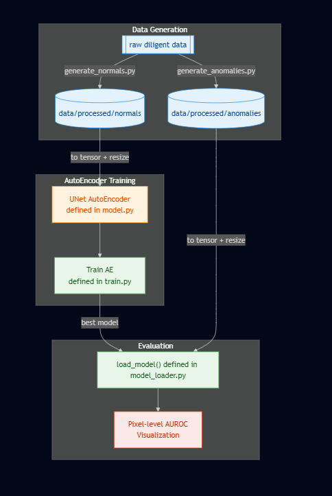
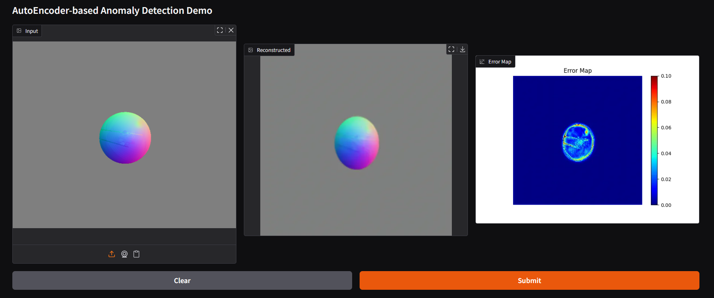

# cv-team5-anomaly-detection


Photometric Stereo(PS)로 얻은 Normal Map과 Autoencoder(AE)를 이용해  
표면 결함을 **pixel-level anomaly map**으로 탐지하는 프로젝트입니다.

---

> ⚠️ **Important Notice (Model 안내)**  
> GitHub의 용량 제한(100MB)으로 인해 학습된 Autoencoder 모델 파일(`best_model_epoch_100.pth`)은  
> 저장소에 포함되어 있지 않습니다.  
> 아래 구글 드라이브 링크에서 모델 파일을 다운로드한 뒤,
>
> **`checkpoints/autoencoder/` 디렉토리 안에 저장하여 실행을 진행해 주세요.**
>
> [🔗 Download best_model_epoch_100.pth](https://buly.kr/FAebWyP)


---


## Table of Contents

1. [📘 Introduction](#introduction)  
2. [👥 Team Members](#team-members)  
3. [📁 Project Structure](#project-structure)  
4. [🔄 Pipeline Overview](#pipeline-overview)  
5. [🛠️ How to Run](#how-to-run)  
6. [📊 Evaluation & Visualization](#evaluation--visualization)  
7. [🎛️ Demo](#demo)  
8. [🚀 Future Work](#future-work)

---

## Introduction 

### Project Overview

본 프로젝트는 DiLiGenT Photometric Stereo 데이터셋을 활용하여  
표면의 법선(normal) 정보를 복원하고, 이를 기반으로 Autoencoder 기반 **Anomaly Detection**을 수행하는 시스템입니다.

- **입력**: Photometric Stereo로부터 얻은 Normal Map  
- **출력**: 재구성된 Normal Map 및 pixel-wise error map  
- **목표**:  
  - 정상(normal) 표면만을 이용해 Autoencoder를 학습  
  - 결함이 포함된 Normal Map을 입력했을 때,  
    재구성 오차를 통해 **결함 영역을 강조하는 heatmap**을 생성

### Motivation

기존 2D 이미지 기반 검사 방식은 조명 조건과 텍스처 변화에 민감하여  
미세 결함을 안정적으로 검출하기 어렵다는 한계가 있습니다.  

Photometric Stereo 기반 Normal Map은 표면의 실제 기하 구조를 잘 반영하고,  
Autoencoder 기반 이상 탐지는 **정상 데이터만으로도 결함을 검출**할 수 있기 때문에  
제조 현장에서의 자동 표면 검사에 유용한 대안이 될 수 있습니다.


---

## Team Members

- 김지우
- 김연희
- 김서현
- 조유민


---

## Project Structure

```bash
cv-team5-anomaly-detection/
├── raw/
│   └── diligent/
│       └── pmsData/                 # DiLiGenT raw images, masks, and lighting metadata
│
├── processed/
│   ├── normals/                     # Generated normal maps (N_*.npy, N_*.png)
│   └── anomalies/                   # Generated anomaly maps (A_*.npy, A_*.png) and masks (M_*.npy, M_*.png)
│
├── results/
│   ├── input/                       # Original input images for inference
│   ├── recon/                       # Autoencoder reconstruction outputs
│   ├── heatmap/                     # Anomaly heatmaps
│   └── mask/                        # Predicted anomaly masks
│
├── src/
│   ├── data_generation/             # Scripts for generating normals and synthetic anomalies
│   │   ├── normal/
│   │   │   ├── generate_normals.py
│   │   │   └── photometric_stereo/
│   │   │       ├── preprocess.py
│   │   │       ├── fps_solver.py
│   │   │       └── diagnostics.py
│   │   └── anomaly/
│   │       ├── generate_anomalies.py
│   │       ├── mapping.py
│   │       └── defect_generator.py
│   │
│   ├── dataprep/                    # Preprocessing pipeline for model training/inference
│   │   ├── transforms.py
│   │   └── normal_map_dataset.py
│   │
│   ├── autoencoder/
│   │   ├── model.py                 # UNet-based autoencoder model
│   │   ├── train.py                 # Autoencoder training script
│   │   └── model_loader.py
│   │
│   ├── evaluation/
│   │   ├── evaluator.py             # Evaluation metrics and scoring logic
│   │   └── visualize.py             # Visualization utilities (heatmaps, reconstructions, etc.)
│   │
│   └── utils/
│       └── image_io.py              # Image loading/saving utilities
│
├── checkpoints/
│   └── autoencoder/
│       └── best_model_epoch_100.pth # Saved checkpoints for trained models
│
├── notebooks/
│   ├── run.ipynb                    # Pipeline execution for development and experimentation
│   └── demo.ipynb                   # Final demo notebook for presentation/submission
│
├── README.md
└── requirements.txt
```

---

## Pipeline Overview

프로젝트 전체 흐름은 아래 이미지와 같습니다:



본 프로젝트의 전체 파이프라인은 아래 단계들로 구성됩니다.

### 📌 1. Photometric Stereo Normal Map 생성

- `raw/diligent/pmsData`의 **다중 조명 이미지**를 이용해  
  `src/data_generation/normal/photometric_stereo` 모듈에서 법선(normal) 추정
- 생성된 Normal Map은 아래 경로에 저장됨:
  - `processed/normals/N_*.npy`
  - `processed/normals/N_*.png`

### 📌 2. Anomaly Synthesis (결함 생성)

- 스크립트: `src/data_generation/anomaly/generate_anomalies.py`
- 정상 Normal Map에 **scratch / dent 등 인공 결함**을 추가하여 anomaly 생성
- 저장 형식:
  - 결함 Normal Map: `A_*.npy`, `A_*.png`
  - GT mask: `M_*.npy`, `M_*.png`
- 저장 경로:
  - `processed/anomalies/`

### 📌 3. Dataset 준비

- 데이터 로더: `src/dataprep/normal_map_dataset.py` 의 `NormalMapDataset`
- prefix에 따라 로드되는 파일:
  - `N_*.npy` → **clean normal**
  - `A_*.npy` + `M_*.npy` → **anomaly normal + mask**
- PyTorch의 `DataLoader`로 묶어 학습 및 평가에 사용

### 📌 4. Autoencoder 학습

- 모델 정의: `src/autoencoder/model.py`  
  → UNet 기반 Autoencoder 구조
- 학습 스크립트: `src/autoencoder/train.py`
- **정상 Normal Map만 사용하여 reconstruction 학습**
- 최종 모델 저장:
  - `checkpoints/autoencoder/best_model_epoch_100.pth`

### 📌 5. Evaluation & Visualization

- 평가 스크립트: `src/evaluation/evaluator.py`
  - **pixel-level AUROC** 계산
- 시각화 스크립트: `src/evaluation/visualize.py`
  - Input Normal  
  - Reconstructed Normal  
  - Error Map  
  - Ground Truth Mask  
- 위 4개 이미지를 **한 Figure에 subplot으로 시각화**  
- 결과 저장 경로:
  - `results/input/`
  - `results/recon/`
  - `results/heatmap/`
  - `results/mask/`

### 📌 6. Demo (Gradio)

- 위치: `notebooks/demo.ipynb`
- 기능:
  - 사용자가 Normal Map 이미지를 업로드하면
    - Autoencoder 재구성 결과 출력
    - Error Map 시각화 출력  
  → 결함 여부를 직관적으로 확인 가능


---

## How to Run

본 프로젝트는 주로 **Google Colab 환경**에서 개발되었습니다.


### 1️⃣ Environment Setup

```bash
git clone https://github.com/your-id/cv-team5-anomaly-detection.git
cd cv-team5-anomaly-detection

pip install -r requirements.txt
```
#### 🛠 필요 환경

- Python 3.x  
- PyTorch, torchvision  
- numpy, matplotlib, scikit-learn, gradio 등


### 2️⃣ Dataset Preparation

#### 📁 데이터 위치
DiLiGenT pmsData를 아래 경로에 위치시킵니다:
```bash
raw/diligent/pmsData/
```

#### 📌 Normal Map 및 Anomaly 데이터 생성

Colab에서 `notebooks/run.ipynb` 실행 후,  
**Data Generation** 섹션의 셀들을 순서대로 실행합니다.

**생성 결과:**
```bash
processed/normals/ → N_.npy, N_.png
processed/anomalies/ → A_.npy, A_.png, M_.npy, M_.png
```

### 3️⃣ Dataset Preprocessing

생성된 Normal/Anomaly 데이터를 모델에 입력할 수 있도록  
`NormalMapDataset` 클래스를 사용해 **Tensor 형태로 전처리**합니다.

### 🔧 전처리 내용

#### ✔️ Normal Map
- `NormalMapToTensor` 적용  
- shape: `(3, H, W)`  
- 값 범위: `[-1, 1]`

#### ✔️ Mask
- `(1, H, W)` 형태로 변환  
- NEAREST interpolation로 리사이즈

### 📦 데이터 로드 예시

```bash
(normal_tensor, mask_tensor(optional), filename)
```
이 과정 후, 준비된 Dataset을 학습 및 평가 단계에서 DataLoader로 불러와 사용합니다.


### 4️⃣ Training

Colab에서 `notebooks/run.ipynb` 실행 후,
**Training Configuration** 섹션을 실행합니다.

학습된 최적 모델은 아래 경로에 저장됩니다:

```bash
checkpoints/autoencoder/best_model_epoch_100.pth
```

### 5️⃣ Evaluation

학습된 모델을 활용하여 anomaly normal map을 다음 단계로 분석합니다:

- **AE 재구성 (Reconstruction)**
- **Error Map 계산**
- **Pixel-level 평가 수행 (AUROC 등)**

Colab에서 `notebooks/run.ipynb`의 **Evaluation** 섹션을 실행하면  
다음 경로에 결과가 자동 저장됩니다:

```bash
results/input/       # 입력 Normal Map
results/recon/       # AE 재구성 결과
results/heatmap/     # Error Map 시각화
results/mask/        # GT Mask 또는 binary mask
```
💡 평가 지표(AUROC 등)는 Colab 셀 출력으로 확인할 수 있습니다.


---

## Evaluation & Visualization

본 프로젝트에서는 Autoencoder가 정상(normal) 패턴을 얼마나 잘 학습했는지 평가하기 위해  
**pixel-level anomaly detection 성능(AUROC)** 과  
**시각적 reconstruction 비교(4-way visualization)** 을 수행합니다.

### 🔍 6.1 Evaluation: Pixel-level AUROC

`src/evaluation/evaluator.py` 에서 다음 과정을 자동으로 수행합니다:

1. **입력 Normal Map (A_*.npy)**  
2. **Autoencoder reconstruction**  
3. **Error Map 계산 (|Input − Recon|)**  
4. **GT Mask(M_*.npy)** 와 비교하여  
5. **Pixel-level AUROC** 계산

Colab에서 `notebooks/run.ipynb`의 *Evaluation 섹션*을 실행하면  
AUROC 값이 셀 출력으로 표시됩니다.

### 🖼️ 6.2 Visualization: 4-way Comparison Plot

`src/evaluation/visualize.py`는 각 샘플에 대해 다음 4개의 이미지를 한 Figure로 합쳐 시각화합니다:

1. **Input Normal Map**  
2. **Reconstructed Normal Map (AE output)**  
3. **Error Map**  
4. **Ground Truth Mask**

이 시각화는 결함 영역이 AE 재구성에서 어떻게 드러나는지 직관적으로 확인하는 데 사용됩니다.

---

## Demo

본 프로젝트는 Autoencoder 기반 표면 결함 탐지를 손쉽게 체험할 수 있도록  
**Gradio 데모 인터페이스**를 제공합니다.  
Colab 환경에서 실행되며, 사용자는 Normal Map 이미지를 업로드하여  
재구성 결과와 error map을 즉시 확인할 수 있습니다.

Colab에서 다음 노트북을 실행합니다:

```bash
notebooks/demo.ipynb
```
다음은 데모 인터페이스 실행 시 나타나는 출력 예시입니다:



---
## Future work

